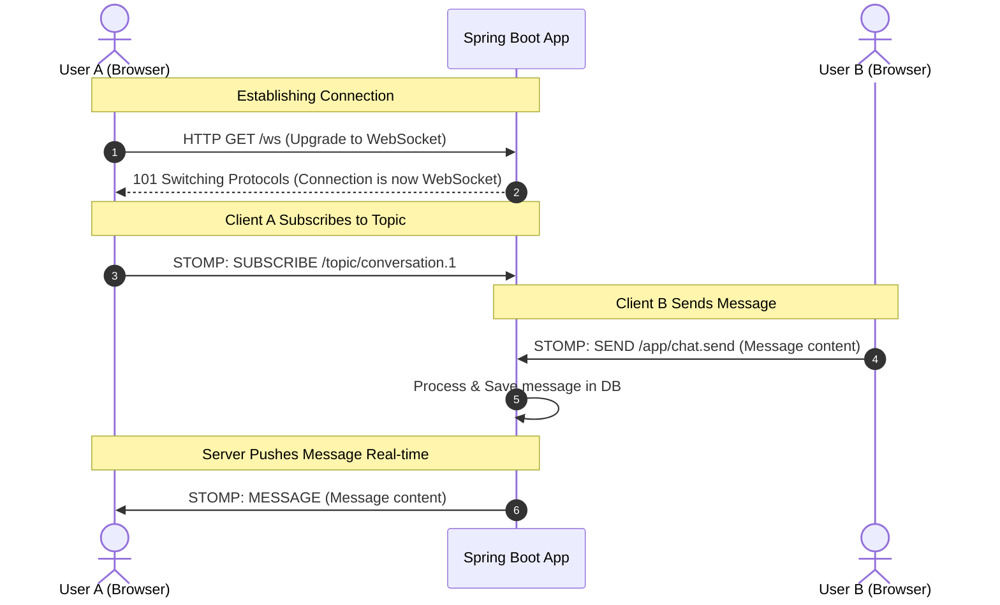

# Spring RabbitMQ Realtime Chat

## Documentation
- [Entity Design](doc/entity_design.md)
- [System Architecture](doc/architecture.md)

## Description
A realtime chat application built with Spring Boot, RabbitMQ, and WebSockets. This project demonstrates a decoupled architecture for efficient message delivery and persistence.

## Application Flow

The following sequence diagram illustrates how WebSockets, STOMP, and the Spring Boot application handle connection, subscription, and message broadcasting in real time between users:

### Detailed Flow Explanation:

1. **Establishing Connection (Steps 1-2)**:
   * **Step 1**: **User A** initiates a handshake by sending a standard HTTP `GET` request to `/ws` with headers requesting a protocol upgrade to WebSocket.
   * **Step 2**: The **Spring Boot App** validates the request and responds with a `101 Switching Protocols` status code. The TCP connection is upgraded and remains open for bidirectional, full-duplex communication.

2. **Client A Subscribes to Topic (Step 3)**:
   * **Step 3**: **User A** sends a STOMP `SUBSCRIBE` frame specifying the destination `/topic/conversation.1`. Spring Boot registers the subscription with the STOMP message broker relay.

3. **Client B Sends Message (Steps 4-5)**:
   * **Step 4**: **User B** sends a message payload via a STOMP `SEND` frame directed to the endpoint prefix `/app/chat.send`.
   * **Step 5**: The **Spring Boot App** receives the message, routes it to the corresponding `@MessageMapping` controller, processes any business logic, and saves the message record to the PostgreSQL database for persistence.

4. **Server Pushes Message Real-time (Step 6)**:
   * **Step 6**: Once persisted, Spring Boot publishes the message event to the message broker relay. RabbitMQ handles the routing, and the Spring Boot application delivers a STOMP `MESSAGE` frame containing the payload back to **User A** (and any other subscribers of `/topic/conversation.1`) over their persistent WebSocket connection.

---

## Getting Started
1. Ensure you have Docker installed.
2. Run `docker-compose up -d` to start PostgreSQL and RabbitMQ.
3. Configure your `.env` file based on `env` example.
4. Run the application using `./gradlew bootRun`.
