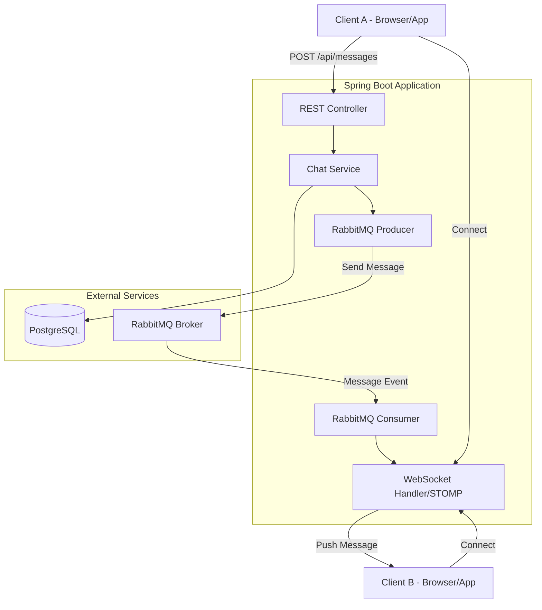

# System Architecture

This document describes the high-level architecture of the Spring Boot Realtime Chat Application using RabbitMQ and WebSockets.

## Overview

The application follows a decoupled architecture where message delivery is handled asynchronously through a message broker (RabbitMQ) and pushed to clients via WebSockets (STOMP).

## Component Diagram



## Data Flow Diagram

```text
Client POST /api/chat/send
        |
        v
   ChatService (save message)
        |
        v
   RabbitMQ Producer
        |
        v
   RabbitMQ Exchange ---> Queue ---> ChatConsumer
                                    |
                                    v
                               WebSocket Server
                                    |
                                    v
                             Client receives realtime
```

## Package Structure

```tree
com.demo.chatApp/
├── adapter/
│   ├── controller/
│   │   ├── AuthController.java
│   │   └── UserController.java
│   ├── mapper/
│   │   ├── AuthMapper.java
│   │   └── UserMapper.java
│   ├── repository/
│   │   ├── JpaUserRepository.java
│   │   └── UserRepositoryAdapter.java
│   ├── seeder/
│   │   └── UserSeeder.java
│   └── value/
│       └── AuthResult.java
├── common/
│   ├── api/
│   │   ├── ApiError.java
│   │   ├── ApiErrorCode.java
│   │   ├── ApiResponse.java
│   │   ├── ApiResponseFactory.java
│   │   ├── GlobalExceptionHandle.java
│   │   ├── Meta.java
│   │   ├── PaginationFactory.java
│   │   └── PaginationMeta.java
│   ├── entity/
│   │   └── BaseEntity.java
│   ├── exception/
│   │   ├── ApiException.java
│   │   ├── BadRequestException.java
│   │   ├── ResourceNotFoundException.java
│   │   └── UnauthorizedException.java
│   └── logging/
│       ├── McdFilter.java
│       └── RequestLoggingFilter.java
├── config/
│   └── SecurityConfig.java
├── domain/
│   ├── entity/
│   │   └── User.java
│   ├── enums/
│   │   └── UserRole.java
│   ├── repository/
│   │   └── UserRepository.java
│   └── service/
│       ├── impl/
│       │   ├── AuthServiceImpl.java
│       │   └── UserServiceImpl.java
│       ├── AuthService.java
│       ├── BaseService.java
│       └── UserService.java
├── dto/
│   ├── auth/
│   │   ├── LoginRequestDto.java
│   │   ├── LoginResponseDto.java
│   │   ├── RegisterRequestDto.java
│   │   └── UserInfoDto.java
│   └── user/
│       ├── UserRequestDto.java
│       ├── UserResponseDto.java
│       └── UserUpdateRequestDto.java
├── security/
│   ├── JwtAuthenticationFilter.java
│   ├── JwtProvider.java
│   ├── JwtUserDetailService.java
│   ├── SecurityErrorHandler.java
│   └── UserPrincipal.java
└── chatApplication.java
```


## Message Flow

1.  **Sending a Message**:
    -   A user sends a message via a REST API endpoint (`POST /api/messages`).
    -   The `ChatService` persists the message in the **PostgreSQL** database.
    -   The `RabbitMQ Producer` publishes the message to a specific **Exchange**.

2.  **Message Routing**:
    -   **RabbitMQ** routes the message based on the routing key (e.g., `chat.conversation.{id}`) to the appropriate queues.

3.  **Real-time Delivery**:
    -   The `RabbitMQ Consumer` listens to the chat queues.
    -   When a message is received, the consumer forwards it to the **WebSocket STOMP Broker**.
    -   The WebSocket broker pushes the message to all clients subscribed to the topic (e.g., `/topic/messages.{conversationId}`).

## Key Technologies

-   **Backend**: Spring Boot 3.4
-   **Database**: PostgreSQL 17
-   **Messaging**: RabbitMQ (AMQP)
-   **Communication**: WebSockets with STOMP
-   **Security**: Spring Security with JWT
-   **Documentation**: Mermaid.js
