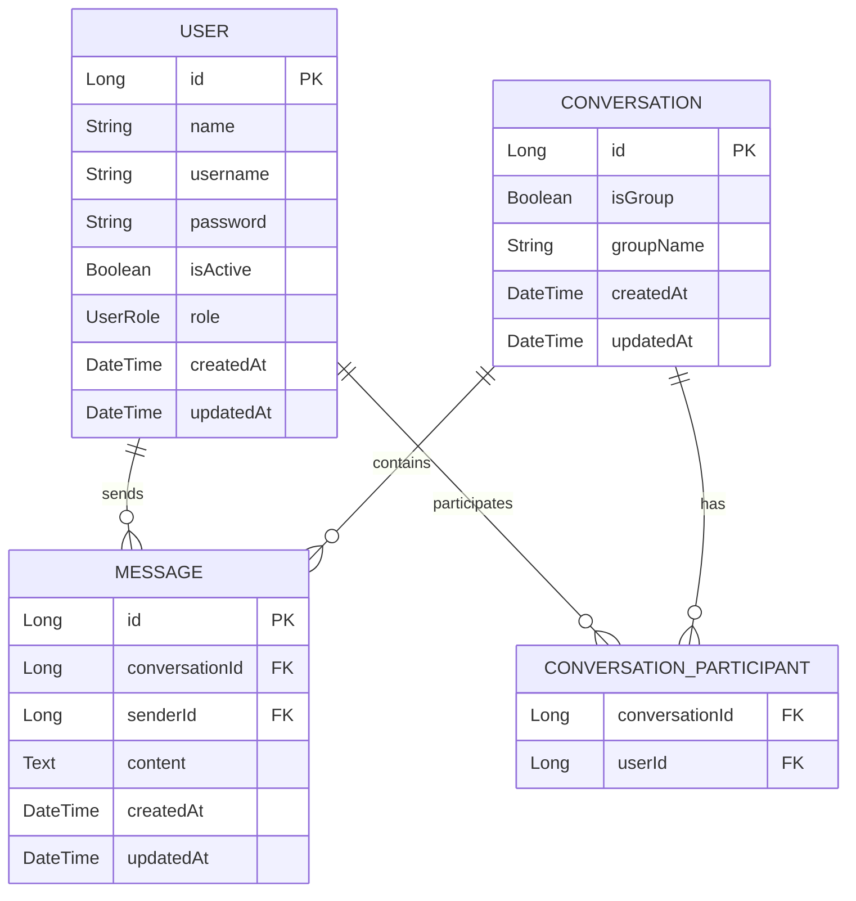

# Entity Design

This document describes the database schema and domain entities for the Realtime Chat Application, aligned with the current codebase.

## Entity Relationship Diagram (ERD)

## Detailed Entity Definitions

### 1. User (Existing)
- `id`: Long (Auto Increment)
- `name`: Full name of the user.
- `username`: Unique username for login. (**Indexed: Unique**)
- `password`: Hashed password.
- `isActive`: Boolean status.
- `role`: UserRole (ADMIN, USER).

### 2. Conversation (Updated)
- `id`: Long (Auto Increment)
- `isGroup`: Boolean flag for group chats. (**Indexed**)
- `groupName`: Name of the group.
- `participants`: Set of `User` entities (ManyToMany).
- `messages`: List of `Message` entities (OneToMany).

### 3. Message (New)
- `id`: Long (Auto Increment)
- `conversation`: The `Conversation` this message belongs to (ManyToOne). (**Indexed**)
- `sender`: The `User` who sent the message (ManyToOne).
- `content`: Text content of the message.
- `createdAt`: Timestamp when message was created. (**Indexed for sorting**)
